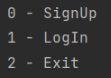
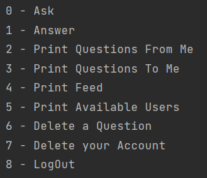

# AskMe

## Brief

AskMe is a Q\&A program with threads provided. There are two main menus:
one for sign up & log in users, and second for running the features.
Program Implemented totally using C++. It uses two csv files for saving
data of users & questions. Program now is in a stable condition,
although it will be enhanced more at the future.

## Classes

  - User: A record for user information

  - UsersManager: The manager of Users that can add, edit, and delete a
    user

  - Question: A record for question information

  - QuesManager: The manager of Questions that can add, answer, and
    delete a question

  - Program: The class that run the whole program. It has current user,
    usersManager, and QuesManager. It’s capable of link them correctly
    to run features with ease

## Namespaces

  - gpm: General Properties & Methods.

  - std

## Sign Menu

## Features

## Requested at

09 C++ OOD and OOP - OOP Part 1 Projects\
Arabic Competitive Programming\
Youtube